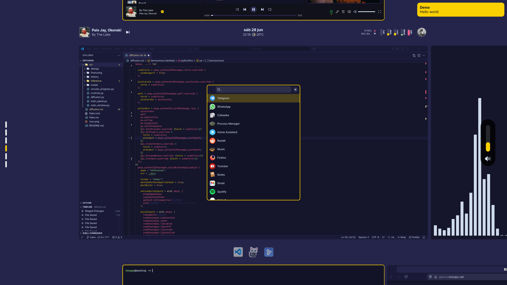

```
        __       __    ___   _    __
    ___/ / ___  / /_  / _/  (_)  / / ___   ___
 _ / _  / / _ \/ __/ / _/  / /  / / / -_) (_-<
(_)\_,_/  \___/\__/ /_/   /_/  /_/  \__/ /___/
```



## Usage

#### install os

```
sudo nixos-rebuild switch --flake https://github.com/knoopx/nix/archive/refs/heads/master.zip#hostname
```

#### install home

```
home-manager switch --flake https://github.com/knoopx/nix/archive/refs/heads/master.zip#username
```

#### update flakes

```
sudo nix flake update
```

#### build

```
sudo nixos-rebuild build --flake path:.
```

#### or alternately

```
nh os switch ~/.dotfiles/
```

#### run in vm

```
nixos-rebuild build-vm --flake path:.
result/bin/run-desktop-vm-vm
```

#### create live usb image

```
nix build path:.#nixosConfigurations.live.config.system.build.isoImage
```

#### deploy

```
sudo nixos-rebuild switch --flake path:.
```

#### repl (:q to quit)

```
nix repl --expr "builtins.getFlake ''$PWD''"
```

#### pin to specific rev until next update

```
nix flake lock --override-input nixpkgs github:NixOS/nixpkgs/revision
```

#### get last cached rev

```
curl -sL "https://monitoring.nixos.org/prometheus/api/v1/query?query=channel_revision" | jq -r ".data.result[] | select(.metric.channel==\"nixos-unstable\") | .metric.revision"
```

## reference

* https://search.nixos.org/options
* https://home-manager-options.extranix.com/
* https://noogle.dev/